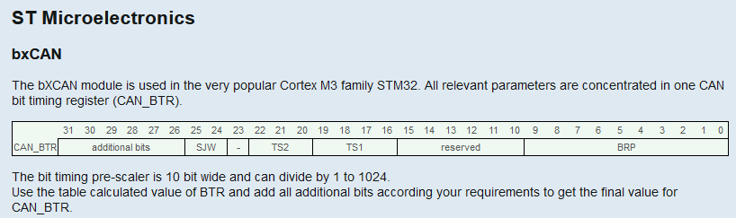
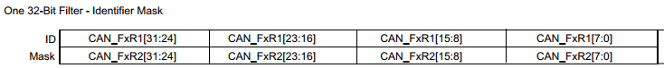

# PROTOCOLO CAN (STM 32)


## 1. Introdução  

Protocolo Serial multi mestre  desenvolvido para alta velocidade, imunidade a ruídos e características de detecção de erros.

* Baixo custo;
* Sistema robusto;
* Retransmissão automática de mensagens de erros;
* Enderaçamento é por mensagens e não ao nó;
* ISO 11898;

Todos os dispositivos podem ouvir a mensagem, mas somente vão receber o que é definido.


## 2. Sinal Diferencial 

O sinal diferencial é utilizado pelo protocolo CAN para mitigação de ruídos.

Os sinais de CAN H e CAN L são complementares 


## 3. Formato das mensagens 

No protocol CAM existem o seguites tipos de frames:

* Frame de dados
* Frame Remoto
* Frame de erro
* Frame de sobre carga
Entretanto os frames manipulais são: de dados e remoto.

### 3.1 Frame de dados (standard)


* Arbitration - define quem vai ter a prioridade da informção;
* Control - bits de controle;
* Data - Dados (max 8 bytes);
* Checksum;
* Bit ACK - determina se a mensagem foi recebida com sucesso; 
* End of frame;


### 3.1  Frame Standard (2.0A - 11 bits de identificação)


### 3.2  Frame Extended (2.0B - 29 bits de identificação)

Retrocompatibilidade com o Standard 2.0A


## 4. Pratica CAN LOOP BACK


Na plataforma STM32 existe a possíbilidade de realizar um teste de loop back no qual o próprio processador faz internamente o fechamento entre Tx e Rx, para isso basta seguir o passo a passo abaixo: 


### 4.1  Ativar a interface CAN 

 


### 4.2  Adicionar o bloco de código no arquivo **can.c**


```C
/* USER CODE END Header */
/* Includes ------------------------------------------------------------------*/
#include "can.h"

/* USER CODE BEGIN 0 */

/* Private typedef -----------------------------------------------------------*/
/* Private define ------------------------------------------------------------*/
/* Private macro -------------------------------------------------------------*/
/* Private variables ---------------------------------------------------------*/
CAN_TxHeaderTypeDef   TxHeader;
CAN_RxHeaderTypeDef   RxHeader;
uint8_t               TxData[8];
uint8_t               RxData[8];
uint32_t              TxMailbox;


/* USER CODE END 0 */

CAN_HandleTypeDef hcan;

/* CAN init function */
void MX_CAN_Init(void)
{

  /* USER CODE BEGIN CAN_Init 0 */

  /* USER CODE END CAN_Init 0 */

  /* USER CODE BEGIN CAN_Init 1 */

  /* USER CODE END CAN_Init 1 */
  hcan.Instance = CAN;
  hcan.Init.Prescaler = 10;
  hcan.Init.Mode = CAN_MODE_LOOPBACK;
  hcan.Init.SyncJumpWidth = CAN_SJW_1TQ;
  hcan.Init.TimeSeg1 = CAN_BS1_13TQ;
  hcan.Init.TimeSeg2 = CAN_BS2_2TQ;
  hcan.Init.TimeTriggeredMode = DISABLE;
  hcan.Init.AutoBusOff = DISABLE;
  hcan.Init.AutoWakeUp = DISABLE;
  hcan.Init.AutoRetransmission = ENABLE;
  hcan.Init.ReceiveFifoLocked = DISABLE;
  hcan.Init.TransmitFifoPriority = DISABLE;


  if(HAL_CAN_Init(&hcan) != HAL_OK)
  {
    /* Initialization Error */
    Error_Handler();
  }

  CAN_FilterTypeDef  sFilterConfig;

  /*##-2- Configure the CAN Filter ###########################################*/
  sFilterConfig.FilterBank = 0;
  sFilterConfig.FilterMode = CAN_FILTERMODE_IDMASK;
  sFilterConfig.FilterScale = CAN_FILTERSCALE_32BIT;
  sFilterConfig.FilterIdHigh = 0x0000;
  sFilterConfig.FilterIdLow = 0x0000;
  sFilterConfig.FilterMaskIdHigh = 0x0000;
  sFilterConfig.FilterMaskIdLow = 0x0000;
  sFilterConfig.FilterFIFOAssignment = CAN_RX_FIFO0;
  sFilterConfig.FilterActivation = ENABLE;
  sFilterConfig.SlaveStartFilterBank = 14;


  if(HAL_CAN_ConfigFilter(&hcan, &sFilterConfig) != HAL_OK)
   {
     /* Filter configuration Error */
     Error_Handler();
   }

   /*##-3- Start the CAN peripheral ###########################################*/
   if (HAL_CAN_Start(&hcan) != HAL_OK)
   {
     /* Start Error */
     Error_Handler();
   }

   /*##-4- Start the Transmission process #####################################*/
     TxHeader.StdId = 0x11;
     TxHeader.RTR = CAN_RTR_DATA;
     TxHeader.IDE = CAN_ID_STD;
     TxHeader.DLC = 2;
     TxHeader.TransmitGlobalTime = DISABLE;
     TxData[0] = 0x03;
     TxData[1] = 0x04;

     /* Request transmission */
     if(HAL_CAN_AddTxMessage(&hcan, &TxHeader, TxData, &TxMailbox) != HAL_OK)
     {
       /* Transmission request Error */
       Error_Handler();
     }

     /* Wait transmission complete */
     while(HAL_CAN_GetTxMailboxesFreeLevel(&hcan) != 3) {}

     /*##-5- Start the Reception process ########################################*/
       if(HAL_CAN_GetRxFifoFillLevel(&hcan, CAN_RX_FIFO0) != 1)
       {
         /* Reception Missing */
         Error_Handler();
       }

       if(HAL_CAN_GetRxMessage(&hcan, CAN_RX_FIFO0, &RxHeader, RxData) != HAL_OK)
       {
         /* Reception Error */
         Error_Handler();
       }

       if((RxHeader.StdId != 0x11)                     ||
          (RxHeader.RTR != CAN_RTR_DATA)               ||
          (RxHeader.IDE != CAN_ID_STD)                 ||
          (RxHeader.DLC != 2)                          ||
          ((RxData[0]<<8 | RxData[1]) != 0xCAFE))
       {
         /* Rx message Error */
         return HAL_ERROR;
       }


  /* USER CODE BEGIN CAN_Init 2 */

  /* USER CODE END CAN_Init 2 */

}
```

### 4.3  Executar em modo debug 

Durante a execução do modo debug adicionar as variaveis abaixo no **Live Expression**


Como demonstrado na imagem acima o, do datos inseridos no buffer Tx [0] = 3 e Tx [1] = 4 foram recebidos no buffer Rx.

Obs: Esse código foi retirado dos exemplos que vem da STM.


### 4.4  Falha no loop back


Caso o loop back não funcione no processador, bastar colocar alguns dos valores de resistores abaixo em PULL UP:


## 5. Configuração de Velocidade 

Para a configuração dos bits de transferência, basta seguir os seguintes passo:

### 5.1
Indentifcar **APB** (Advanced Peripheral Bus) o qual está a interface CAN e o clock utilizado, no caso do **STM32F072x** é o APB1 que é unico nas interfaces.


### 5.2 

Uma vez identificada a interface e o clock, acessar o link abaixo da calculadora oline:

~~~~
http://www.bittiming.can-wiki.info/
~~~~

[CAN Bit Time Calculation](http://www.bittiming.can-wiki.info/)


Uma vez acessada a calculadora, basta selecionar o fabricante no combo box, nesse caso **ST Microeletronics bxCAN** e adicinonar o clock do APB da interface CAN no campo Clock Rate e clicar no botão Request Table.


### 5.3 


Após a execução dos passo anterios, será gerada a tabela com os valores recomendados de acordo com as configurações utilizadas do seu processados, no caso foi utilizado o **STM32F072x** como base.


~~~~
Yellow background rows are settings with recommended values, with an bittime consisting of 16 time quanta tq (Number of time quanta). At the time this tool was first developed, this seems to be the best value. in these days where we talk about CAN FD, as much as possible time quanta should be used to construct an bit time.
~~~~


~~~~
Type: bxCAN, Clock: 48MHz, max brp: 1024, SP: 87.5%, min tq: 8, max tq: 25, FD factor: undefined, SJW: 1
~~~~




~~~~
http://www.bittiming.can-wiki.info/#bxCAN
~~~~


## 6. Filtro CAN 

Filtro CAN limita quais as mensagens serão recebida de acordo com as configurações.

Verificar no manual de referencia a quantidade filtros disponíveis para o precessador, no caso **STM32F072x** teremos 14 filtros disponíveis.


## 7. Tipos de filtros filtros 

Nas configurações de filtros do protocolo CAN, existe dois tipos de filtros MASK_MODE e LIST_MODE.
Ambos os filtros utilizam dois registradores sendo eles de 32 Bits ou de 16 Bits dependendo da configuração utilzada no parâmetro **FilterScale**  


### 7.1 Mask mode 

Como mencionado o modo MASK utiliza os dois registradores denominados de:  **ID_REGISTER** e **MASK_REGISTER** e a verificação fica da seguinte forma:

~~~~
(ID_REGISTER == MASK_REGISTER)
~~~~

Registradores 16 bits


Registradores 32 bits



### 7.2 Mask mode 

O modo list também utiliza os dois registradores demoninados de: **ID_REGISTER1** e **ID_REGISTER2** e a verificação fica da seguinte forma:

~~~~
(ID_REGISTER == ID_REGISTER && MASK_REGISTER = MASK_REGISTER)

~~~~


```C
*#######  CONFIGURAÇÂO LIST MODE 4 (16 bits Registers) #####
 

  //** When using CAN_FILTERSCALE_16BIT in combination with CAN_FILTERMODE_IDLIST the mask
  // high and mask low variables also contain 11-bit-IDs. You can set a filter bank for 4 11-bit-IDs
 // with ID list mode this way.

  //The ID needs to be shifted to the correct position in the corresponding register. This is different for 16 Bit
  //and 32 Bit scale. For 32 bit scale refer to the microcontroller reference manual. For 16 bit scale here is an

   uint32_t d1 = 0x11;
   uint32_t d2 = 0x12;
   uint32_t d3 = 0x13;
   uint32_t d4 = 0x25;

  sFilterConfig.FilterActivation     = ENABLE;
  sFilterConfig.FilterFIFOAssignment = CAN_RX_FIFO0;
  sFilterConfig.FilterScale          = CAN_FILTERSCALE_16BIT;
  sFilterConfig.FilterMode           = CAN_FILTERMODE_IDLIST;

  sFilterConfig.FilterIdHigh         = d1 << 5u;
  sFilterConfig.FilterIdLow          = d2 << 5u;
  sFilterConfig.FilterMaskIdHigh     = d3 << 5u;
  sFilterConfig.FilterMaskIdLow      = d4 << 5u;
  sFilterConfig.FilterBank = 0;
  sFilterConfig.SlaveStartFilterBank = 14;

```


```C


```